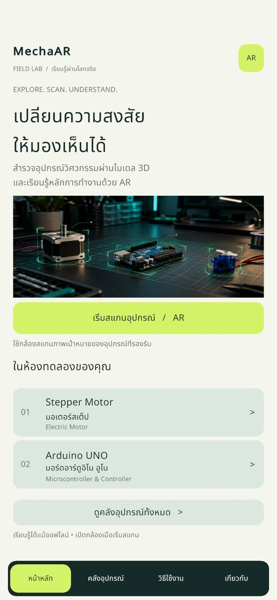
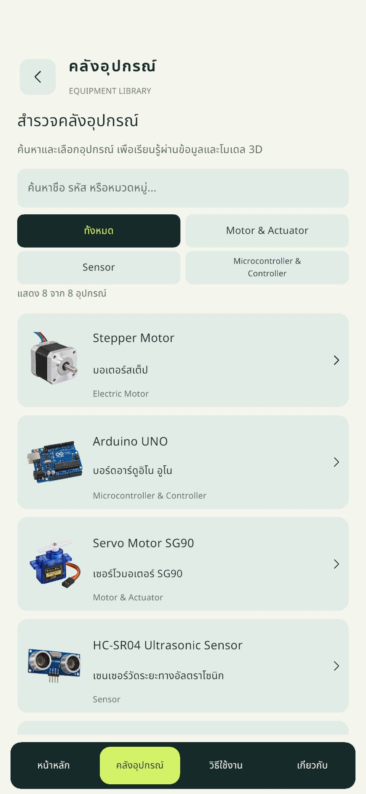
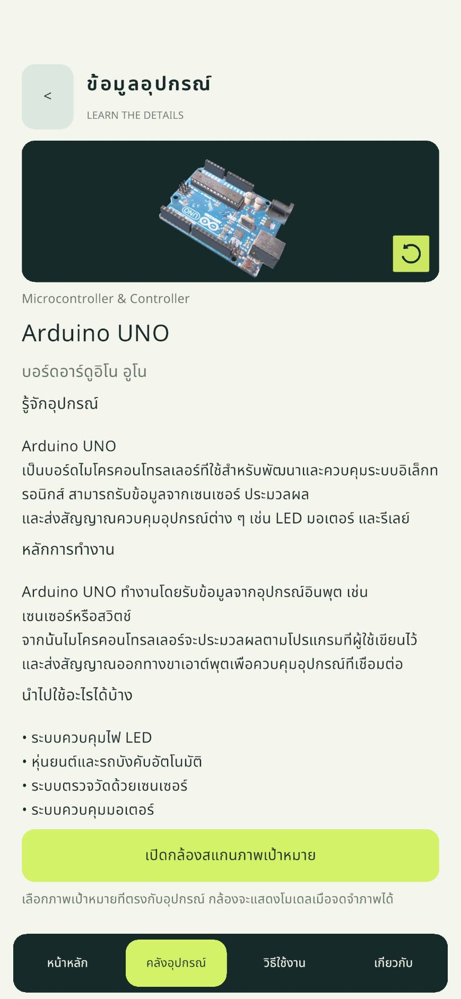
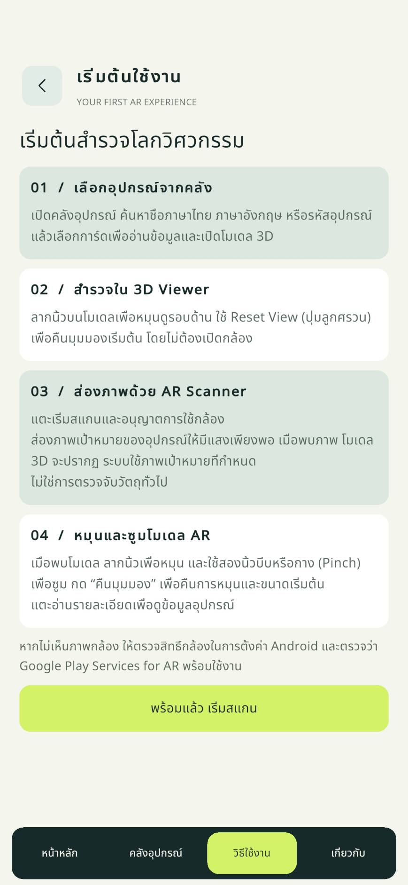
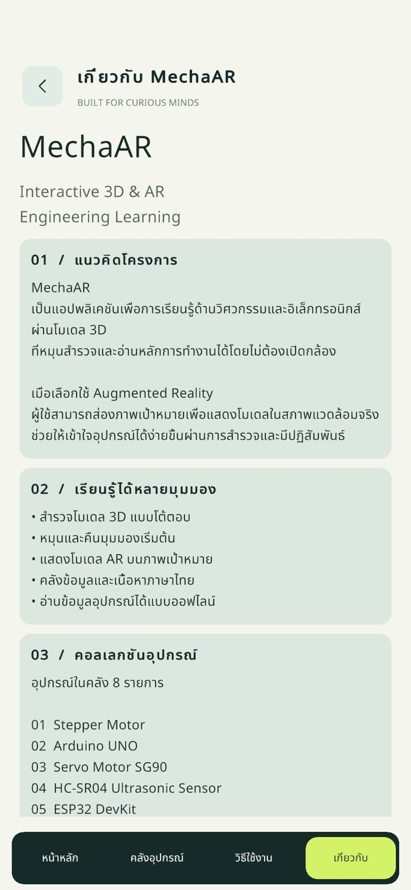
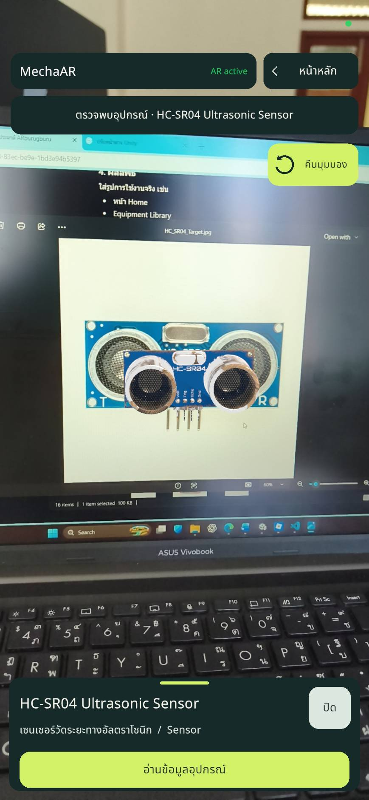
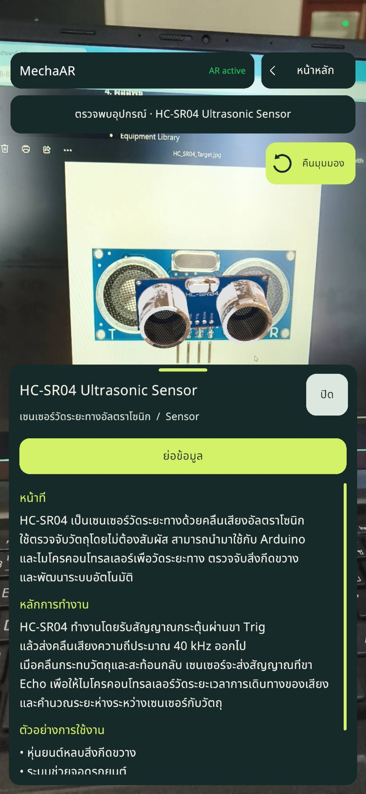

# MechaAR

**Explore engineering equipment through interactive 3D models and augmented reality.**

Android · Unity 6.3 LTS · **v1.0.0**

## Project Overview

MechaAR is an Android learning application that combines an equipment library, technical information, a 3D viewer, and image-based AR. Learners can explore equipment on screen or scan a matching image target to view its model in their surroundings.

แอปพลิเคชันสำหรับเรียนรู้อุปกรณ์วิศวกรรมผ่านข้อมูล โมเดลสามมิติ และเทคโนโลยีความเป็นจริงเสริม

## Features

- **Equipment Library:** browse eight engineering devices.
- **Search & Filter:** search by Thai name, English name, or equipment ID; combine search with category filters.
- **Equipment Detail:** read descriptions, working principles, and applications.
- **3D Viewer:** drag to rotate a model and reset its view.
- **AR Image Tracking:** scan a configured image target to display its associated model.
- **AR Interaction:** drag to rotate, pinch to zoom, and reset rotation and scale.
- **Tutorial & About:** usage guidance and project information.

## Supported Equipment

| ID | Equipment |
| --- | --- |
| EQ001 | Stepper Motor |
| EQ002 | Arduino UNO |
| EQ003 | Servo Motor SG90 |
| EQ004 | HC-SR04 Ultrasonic Sensor |
| EQ005 | ESP32 DevKit |
| EQ006 | DHT11 |
| EQ007 | L298N Motor Driver |
| EQ008 | TT DC Gear Motor |

## Tech Stack

| Technology | Role |
| --- | --- |
| Unity 6.3 LTS (`6000.3.21f1`) | Game engine and Android application development |
| C# | Application logic |
| AR Foundation `6.3.5` | AR session and image tracking |
| Google ARCore XR Plugin `6.3.5` | Android AR provider |
| Universal Render Pipeline (URP) `17.3.0` | Rendering |
| OpenGLES3 | Android graphics API |
| TextMeshPro | UI text, including Thai |
| Input System `1.20.0` | Input handling |

## Project Structure

```text
MechaAR/
├── Assets/
│   ├── Scenes/MechaAR_Main.unity  # Main application scene
│   ├── Scripts/
│   │   ├── AR/                   # Tracking and AR interaction
│   │   ├── Equipment/            # Equipment data and database code
│   │   └── UI/                   # Navigation, library, and 3D viewer
│   ├── EquipmentData/            # Equipment data assets
│   ├── ImageLibraries/           # AR reference image library
│   ├── ImageTargets/             # Target images
│   ├── Models/                   # Model assets
│   ├── Prefabs/                  # Reusable objects
│   ├── Materials/                # Materials
│   └── UI/                       # UI assets
├── Packages/                     # Package dependencies
├── ProjectSettings/              # Unity project configuration
└── README.md
```

## Requirements

- Unity Hub and **Unity 6.3 LTS (`6000.3.21f1`)**.
- Android Build Support, including Android SDK & NDK Tools and OpenJDK, installed through Unity Hub.
- Git and an internet connection for cloning and restoring Unity packages.
- For device testing: an **ARCore-supported Android device**, Google Play Services for AR, and camera permission.
- Current project settings target **ARM64**, with minimum **Android 10 / API 29**. Android version alone does not guarantee ARCore compatibility.
- A matching reference image from `Assets/ImageTargets/` for AR scanning.

## Clone & Open in Unity

```bash
git clone https://github.com/Nattasith0/MechaAR.git
cd MechaAR
```

1. In Unity Hub, choose **Add project from disk** and select the cloned folder.
2. Open with Unity `6000.3.21f1` and wait for package restoration and asset import.
3. Open `Assets/Scenes/MechaAR_Main.unity`.
4. Enter Play Mode to explore the UI and 3D viewer. Validate camera tracking and touch gestures on an Android device.

## Build for Android

1. Open **File → Build Profiles**, select Android, and switch to the Android platform.
2. Confirm `Assets/Scenes/MechaAR_Main.unity` is enabled in the scene list.
3. Keep the existing Android configuration: **ARCore**, **URP**, **OpenGLES3**, and **ARM64**.
4. For a local APK, leave **Build App Bundle** disabled and select **Build**. Save the output outside `Assets/`, such as `Builds/Android/`.
5. Install on a supported device, allow camera access, and scan a matching target image. Use **Build And Run** if the device is connected and USB debugging is authorized.

Release signing and distribution require the project's own signing configuration. Do not commit keystores or passwords.

## Screenshots

Actual app screenshots from `Docs/images/`. Select an image to view it at full size.

<p align="center">
  <a href="Docs/images/home.jpg"></a>
  <a href="Docs/images/library.jpg"></a>
  <a href="Docs/images/detail.jpg"></a>
</p>

<p align="center">Home · Equipment Library · Equipment Detail</p>

### Equipment Detail & 3D Viewer

The Arduino UNO detail screen includes the **3D Viewer** above the equipment information, with drag-to-rotate interaction and a reset-view button. Both features are shown in the same screenshot.

<table>
  <tr><th>Tutorial</th><th>About</th></tr>
  <tr>
    <td align="center"><a href="Docs/images/tutorial.jpg"></a></td>
    <td align="center"><a href="Docs/images/about.jpg"></a></td>
  </tr>
</table>

### AR Scanner / AR on Device

HC-SR04 tracked over its reference image, with the equipment information panel collapsed and expanded. Despite their filenames, these two images show the **AR Scanner**, not the standalone 3D Viewer.

<table>
  <tr><th>AR Model & Controls</th><th>AR Equipment Information</th></tr>
  <tr>
    <td align="center"><a href="Docs/images/3d-viewer.jpg"></a></td>
    <td align="center"><a href="Docs/images/3d-viewer-detail.jpg"></a></td>
  </tr>
</table>

## Release / APK

**Version: v1.0.0**

- Release page: **TODO — add the published GitHub Release link.**
- Android APK: **TODO — add the download link after final QA and publication.**

<!-- Replace with verified links once published:
[Release v1.0.0](RELEASE_URL)
[Download Android APK](APK_DOWNLOAD_URL)
-->

## Known Limitations

- Android is the V1 target platform; no iOS release is provided here.
- AR recognizes configured **image targets**, not arbitrary physical equipment.
- Tracking quality depends on lighting, image visibility, camera angle, and device support.
- The 3D Viewer supports rotation and reset; pinch zoom is available in AR.
- V1 contains eight equipment entries. It does not provide circuit simulation or automatic equipment recognition.
- HC-SR04 color, AR scale, and gestures have been confirmed on Redmi. Detailed confirmation for the remaining final device QA cases is still pending; this README does not claim full Android QA completion.

## Future Development (V2)

Planned ideas, **not included in V1**:

- Learning Hotspots
- AI Scanner
- Quizzes
- Wiring Guides
- Circuit / equipment simulation

These are future directions, not a release commitment.

## Credits / 3D Model Sources

Verified on 2026-10-04: the source URLs, model titles, creator accounts, and licenses embedded in the eight GLB files under `Assets/Models/` match the public Sketchfab model API. Sketchfab labels these licenses **CC Attribution** (Creative Commons Attribution), linking to **CC BY 4.0**.

| Equipment | Creator | Original model / source | License |
| --- | --- | --- | --- |
| Stepper Motor | moogh | [Nema 17 Stepper Motor (42mm x 48mm)](https://sketchfab.com/3d-models/nema-17-stepper-motor-42mm-x-48mm-b970d52c4b554768a1b576cb381abf07) | [CC Attribution (CC BY 4.0)](https://creativecommons.org/licenses/by/4.0/) |
| Arduino UNO | crimsonfalcon | [Arduino Uno Board](https://sketchfab.com/3d-models/arduino-uno-board-f31feafc5e9743abbdf33c54f9d92669) | [CC Attribution (CC BY 4.0)](https://creativecommons.org/licenses/by/4.0/) |
| Servo Motor SG90 | peddintiudaykiran176 | [Servo Motor sg 90](https://sketchfab.com/3d-models/servo-motor-sg-90-527862090927476fbb1f525b1ba93046) | [CC Attribution (CC BY 4.0)](https://creativecommons.org/licenses/by/4.0/) |
| HC-SR04 (current V2 model asset) | Mustafa Özgen | [3D PBR Rusty HC-SR04 Ultrasonic Sensor](https://sketchfab.com/3d-models/3d-pbr-rusty-hc-sr04-ultrasonic-sensor-d1931de6d50540eca718665e1b49f9fe) | [CC Attribution (CC BY 4.0)](https://creativecommons.org/licenses/by/4.0/) |
| ESP32 DevKit | Davyd Tovstyj (@davydtovstyj) | [ESP32](https://sketchfab.com/3d-models/esp32-78c2b5a932a1463bbc6e8ada630a0545) | [CC Attribution (CC BY 4.0)](https://creativecommons.org/licenses/by/4.0/) |
| DHT11 | Vicale200 | [Temperature and humidity sensor DHT11](https://sketchfab.com/3d-models/temperature-and-humidity-sensor-dht11-77a5f7b07f3740678a8cf3edab612723) | [CC Attribution (CC BY 4.0)](https://creativecommons.org/licenses/by/4.0/) |
| L298N Motor Driver | Robótica Paraná | [Driver Ponte H L298N](https://sketchfab.com/3d-models/driver-ponte-h-l298n-d0855802156c46539d7c2eaf96600c16) | [CC Attribution (CC BY 4.0)](https://creativecommons.org/licenses/by/4.0/) |
| TT DC Gear Motor / BO Motor | peddintiudaykiran176 | [BO (Battery Operated) Motor](https://sketchfab.com/3d-models/bo-battery-operated-motor-8814186842ac429fb01bf687a2bdce33) | [CC Attribution (CC BY 4.0)](https://creativecommons.org/licenses/by/4.0/) |

**Unity integration:** model prefabs are adapted for use in MechaAR, including scale adjustments where needed. The current HC-SR04 model was modified for Unity integration with a scaled GLB root and a URP/Simple Lit PCB material. These integration changes do not imply endorsement by the original creators.

The HC-SR04 entry credits the replacement GLB used by `HC_SR04_V2`, not the older `hc-sr04.glb`. Here, “V2 model asset” identifies the replacement asset used in MechaAR V1, not an application V2 feature.

The legacy `Assets/Models/HC_SR04/hc-sr04.glb` also remains in the repository: [HC-SR04](https://sketchfab.com/3d-models/hc-sr04-e8a6adcef8fd4f45bf27b8d7718ed489) by peddintiudaykiran176. Its embedded metadata and the Sketchfab API confirm [CC Attribution (CC BY 4.0)](https://creativecommons.org/licenses/by/4.0/). This separate attribution covers the retained legacy file; it is not the current EQ004 model.

**Third-party assets retain their original licenses.** The model licenses above do not establish a license for MechaAR source code or other assets.

- Fonts, images, and other third-party assets: **TODO — add verified sources and required notices.**
- Repository source-code license: **TODO — specify the intended license.**

## Developer

- **GitHub:** [Nattasith0](https://github.com/Nattasith0)

---

**MechaAR v1.0.0 — Explore · Scan · Understand**
